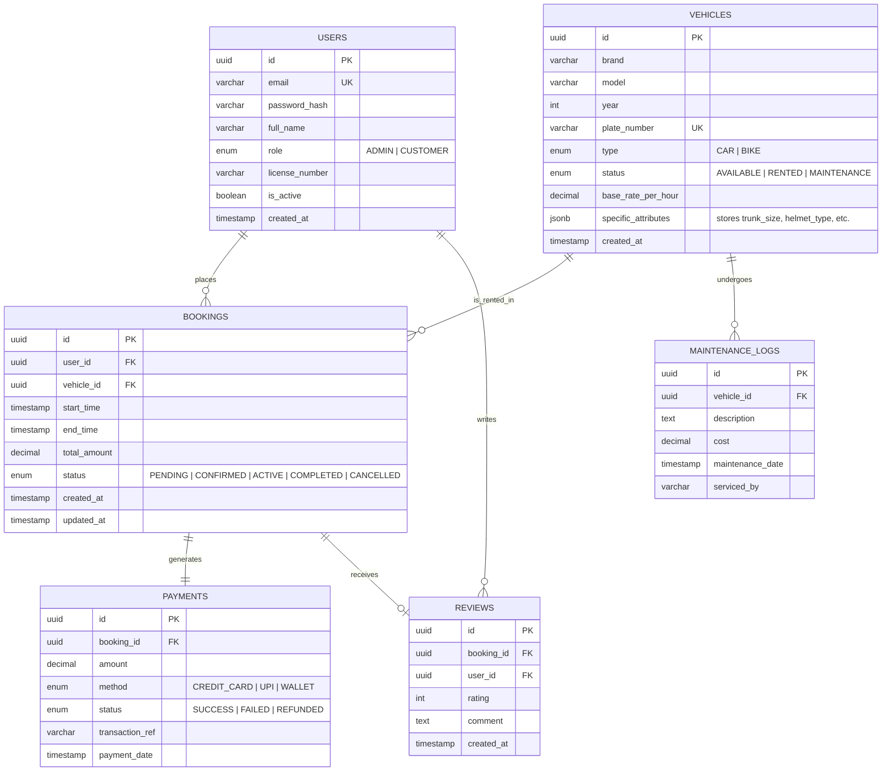

# ER Diagram — WheelCheck

## Overview

This Entity-Relationship diagram represents the relational database schema for **WheelCheck**. 
It is designed to handle **Single-Table Inheritance** for vehicles (storing Cars and Bikes in one fleet table with discriminators), rigorous **Booking State Management**, and **Financial auditing**.

---

## Table Summary

| Table | Description | Key Relationships |
|-------|------------|------------------|
| USERS | Stores all system actors. The `role` column distinguishes Admins from Customers. | → Bookings, Reviews |
| VEHICLES | **Polymorphic Table.** Stores both Cars and Bikes. Uses `type` as a discriminator and `specific_attributes` (JSONB) for subclass data like `trunk_size` or `helmet_type`. | → Bookings, Maintenance Logs |
| BOOKINGS | The core transactional table linking Users and Vehicles. Tracks the lifecycle state (Pending → Confirmed). | ← User, Vehicle   → Payment |
| PAYMENTS | Financial records linked 1:1 with Bookings. | ← Booking |
| MAINTENANCE_LOGS | Tracks vehicle service history. Essential for the Admin's fleet management dashboard. | ← Vehicle |

## Key Indexes

| Table | Index | Purpose |
|-------|-------|---------|
| USERS | (`email`) | Fast lookup during Login/Auth. |
| VEHICLES | (`status`, `type`) | Optimizes the "Search Available Cars/Bikes" query. |
| BOOKINGS | (`vehicle_id`, `start_time`, `end_time`) | **Critical Index:** Used to detect overlap and prevent double-booking. |
| BOOKINGS | (`user_id`, `status`) | Quickly fetch "My Active Bookings" for customers. |
| PAYMENTS | (`booking_id`) | Fast retrieval of payment status for a specific rental. |
