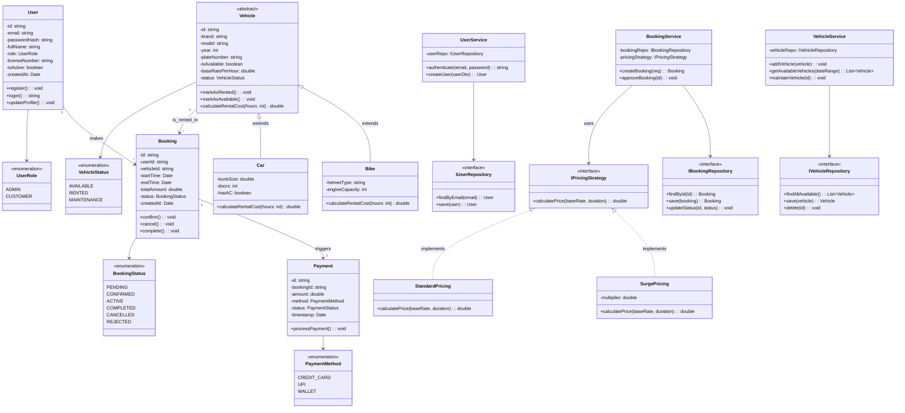

# Class Diagram — WheelCheck

## Overview

This class diagram represents the core domain models and architectural layers of the **WheelCheck** Vehicle Rental System.
The design adheres to **Clean Architecture**, utilizing **Abstract Base Classes** for the vehicle hierarchy to demonstrate strict **OOP Inheritance** and **Design Patterns** for scalable pricing logic.

---

## Design Patterns Applied

| Pattern    | Where Applied                                             | Purpose                                                                 |
|------------|----------------------------------------------------------|-------------------------------------------------------------------------|
| Strategy   | IPricingStrategy, StandardPricing, SurgePricing         | Allows switching between pricing logic (e.g., Weekend rates vs Normal rates) without changing code. |
| Factory    | VehicleService (Internal logic)                         | Used to instantiate the correct class (Car vs Bike) based on input data. |
| Repository | IVehicleRepository, IBookingRepository                  | Decouples the business logic from the database implementation.         |
| State      | BookingStatus                                           | Manages the complex lifecycle of a rental (Pending → Confirmed → Active → Completed). |

---

## OOP Principles Applied

| Principle      | Application |
|---------------|------------|
| Inheritance   | Car and Bike inherit common attributes (brand, model, rate) from the abstract Vehicle class to avoid code duplication. |
| Polymorphism  | calculateRentalCost() is defined in Vehicle but overridden in Car (adds AC charges) and Bike (adds helmet fees). |
| Abstraction   | IVehicleRepository hides the complex SQL/Database queries from the Service layer. |
| Encapsulation | All fields (e.g., -passwordHash) are private and accessed only through public methods to protect data integrity. |
