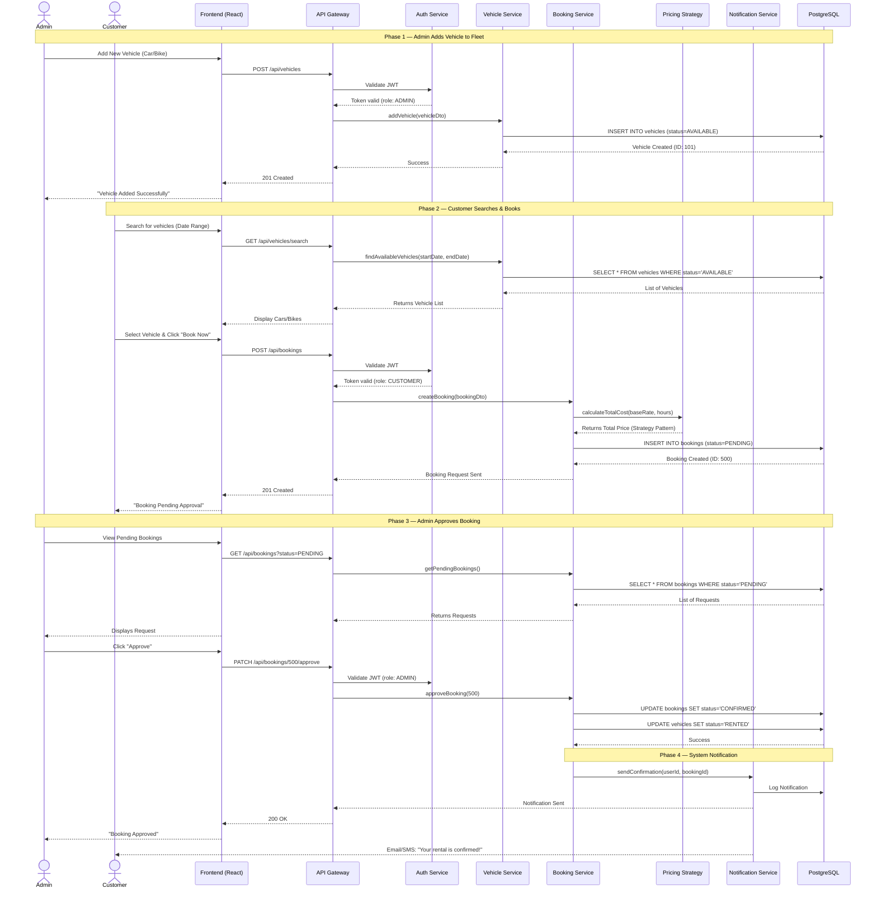

# Sequence Diagram — WheelCheck

## Main Flow: End-to-End Vehicle Rental (Admin Adds Vehicle → Customer Books → Admin Approves)

This sequence diagram illustrates the complete lifecycle of a rental transaction on the WheelCheck platform — from fleet management to booking confirmation.

---

## Flow Summary

| Phase | Description | Key Patterns Used |
|-------|------------|-------------------|
| 1. Fleet Management | Admin adds a new vehicle (Car or Bike) after authentication. The system stores specific attributes based on the vehicle type. | Factory Pattern (to create Car vs Bike objects) |
| 2. Search & Pricing | Customer browses inventory. When booking, the system calculates price dynamically based on rules (e.g., weekend rates). | Strategy Pattern (for pricing logic) |
| 3. Booking Request | The booking is created with a "PENDING" state. It does not block the schedule until confirmed to avoid conflicts. | State Pattern (Managing Booking Status) |
| 4. Approval & Notify | Admin reviews and confirms the request. The system updates the vehicle status to "RENTED" and triggers a notification. | Observer Pattern (Notification trigger) |
