# Use Case Diagram — WheelCheck

## Overview

This diagram represents the functional requirements of the **WheelCheck** Vehicle Rental System. The interaction is divided between two primary actors: the **Customer** (who searches and rents vehicles) and the **Admin** (who manages the fleet and approves requests).

The system focuses on **Inventory Management (Polymorphism)**, **Booking Lifecycle**, and **Role-Based Access Control**.

---

```mermaid
graph TB
    subgraph WheelCheck System
        UC1["Register / Login"]
        UC2["Manage Profile"]
        UC3["Search & Filter Vehicles"]
        UC4["View Vehicle Details"]
        UC5["Check Availability"]
        UC6["Book Vehicle"]
        UC7["View Booking History"]
        UC8["Cancel Booking"]
        UC9["Add Vehicle to Fleet"]
        UC10["Update Vehicle Details"]
        UC11["Remove Vehicle"]
        UC12["View All Bookings"]
        UC13["Approve / Reject Booking"]
        UC14["Manage Pricing Rules"]
    end

    Customer((Customer))
    Admin((Admin))

    %% Customer interactions
    Customer --> UC1
    Customer --> UC2
    Customer --> UC3
    Customer --> UC4
    Customer --> UC5
    Customer --> UC6
    Customer --> UC7
    Customer --> UC8

    %% Admin interactions
    Admin --> UC1
    Admin --> UC9
    Admin --> UC10
    Admin --> UC11
    Admin --> UC12
    Admin --> UC13
    Admin --> UC14
```

| Use Case ID | Use Case                     | Actors    | Description                                                                 |
|------------|------------------------------|----------|-----------------------------------------------------------------------------|
| UC1        | Register / Login              | All      | Authenticate users using JWT. Distinguish between Admin and Customer roles. |
| UC2        | Manage Profile                | Customer | Update contact info and driving license details.                           |
| UC3        | Browse Vehicles               | Customer | Browse fleet with filters for Type (Car/Bike), Price, and Brand.           |
| UC4        | Check Availability            | Customer | Verify if a vehicle is free for the selected date range.                   |
| UC5        | Book Vehicle                  | Customer | Create a rental request (Initially set to "Pending").                      |
| UC6        | View Booking History          | Customer | View past and active rentals with their current status.                    |
| UC7        | Cancel Booking                | Customer | Cancel a "Pending" or "Confirmed" booking before the start date.           |
| UC8        | Add Vehicle                   | Admin    | Register a new vehicle into the system with specific attributes.           |
| UC9        | Update Vehicle                | Admin    | Modify vehicle stats, rental rates, or maintenance status.                 |
| UC10       | Remove Vehicle                | Admin    | Soft-delete a vehicle to remove it from availability.                      |
| UC11       | View All Bookings             | Admin    | Detailed view of all rental requests across the platform.                  |
| UC12       | Approve / Reject Booking      | Admin    | Change booking status from "Pending" to "Confirmed" or "Rejected".         |
| UC13       | Manage Pricing Rules          | Admin    | Configure specific base rates or surge pricing logic.                      |
| UC14       | Auto-Calculate Cost           | System   | Automatically calculate total price based on duration and vehicle type.    |

